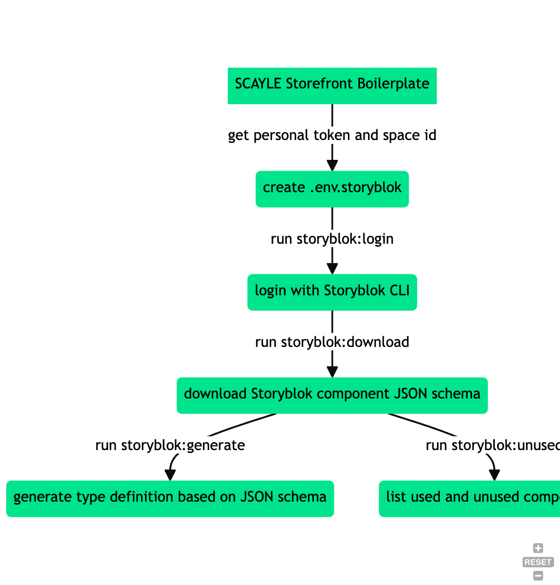
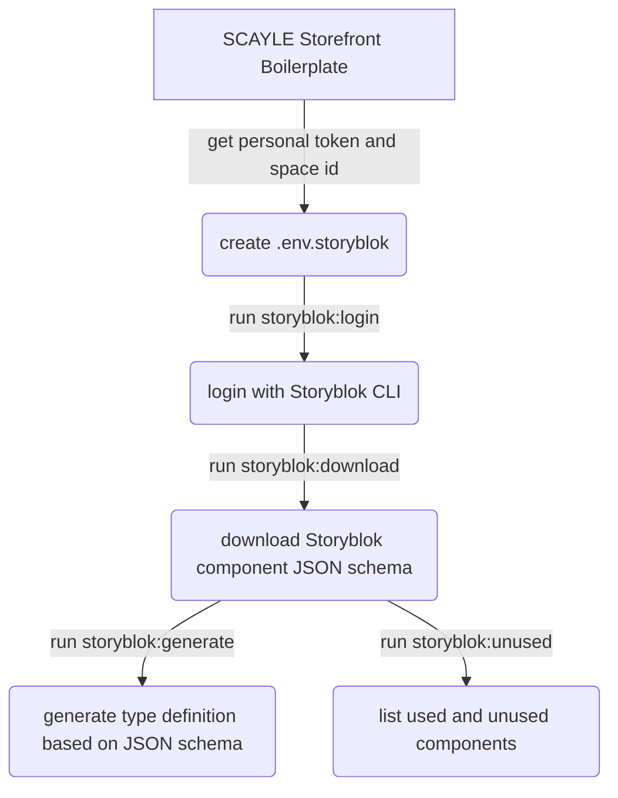

# SCAYLE Storefront Boilerplate - Feature: CMS Storyblok

This document outlines the headless CMS feature implementation for [Storyblok](https://www.storyblok.com) within the Nuxt 3-based SCAYLE Storefront Boilerplate.

_Last updated: 09. October 2023_

## What is Storyblok?

Storyblok is a headless content management system (CMS) that allows you to create and manage digital content across multiple platforms and devices.
It is the CMS used by the vast majority of SCAYLE customers, and because we have the most experience with this CMS,
it is the one we recommend to new customers.

### Quick links

- [Developer Guides](https://www.storyblok.com/docs/guide/introduction)
- [Editor Guides](https://www.storyblok.com/docs/editor-guideshttps://www.storyblok.com/docs/editor-guides)
- [Storyblok Walkthrough (YouTube)](https://www.youtube.com/watch?v=902M1Pt6yW8)

## Out-of-the-Box components

The following components are implemented as part of the Storefront Boilerplate,
which means they are available out-of-the-box for all shops that are scaffolded from the Storefront Boilerplate - that is, all SCAYLE shops.

### Base Storyblok Components

- `Accordion`
- `AccordionEntry`
- `Banner`
- `BannerLink`
- `ClickableImage`
- `CmsImage`
- `CmsLink`
- `CmsText`
- `CmsVideo`
- `DetailImage`
- `Grid`
- `GridTile`
- `ImageSlider`
- `ImageSliderSlide`
- `ImageText`
- `Page`
- `Product`
- `ProductSlider`
- `ScrollableLinkList`
- `SlideShow`
- `Story`
- `StoryblokLink`

## Default usage within Storefront Boilerplate

The following section contains an overview of all shop areas, that use Storyblok content and their options.

_NOTE:_ For an actual reference which values are optional and what value types are expected for each option, check the type definition!

### Area: Homepage

### Component: `SlideShow`

- _Options:_
  - `h1`: accepts a string
  - `slides`: accepts a list of `SbSlide`
  - `margin_top`: accepts a string

### Component: `Slide`

- _Options:_
  - `image`: accepts an image or video
  - `topline`: accepts a string
  - `headline`: accepts a string
  - `cta_label`: accepts a string
  - `cta_url`: accepts a link
  - `is_dark`: accepts a boolean
  - `align`: accepts either `start`, `center` or `end`
  - `justify`: accepts either `start`, `center` or `end`

### Component: `ImageSlider`

- _Options:_
  - `headline`: accepts an string
  - `cta_label`: accepts an string
  - `cta_url`: accepts an string
  - `slides`: accepts a list of `SbImageSliderSlide`
  - `margin_top`: accepts a string

### Component: `ImageSliderSlide`

- _Options:_
  - `image`: accepts an image or video
  - `topline`: accepts a string
  - `headline`: accepts a string
  - `is_new`: accepts a boolean
  - `cta_label`: accepts a string
  - `cta_url`: accepts a link
  - `item_id`: accepts a string
  - `item_name`: accepts a string
  - `promotion_id`: accepts a string
  - `promotion_name`: accepts a string
  - `creative_name`: accepts a string
  - `creative_slot`: accepts a string

### Component: `Grid`

- _Options:_
  - `margin_top`: accepts a string
  - `is_containered`: accepts a boolean
  - `is_containered_desktop`: accepts a boolean
  - `is_spaced`: accepts a boolean
  - `columns`: accepts a reference to a placable Storyblok component

### Component: `GridTile`

- _Options:_
  - `content`: accepts a reference to a placable Storyblok component
  - `headline`: accepts a string
  - `cta`: accepts a string
  - `cta_link`: accepts a link

### Component: `ImageText`

- _Options:_
  - `align`: accepts a string
  - `image`: accepts a list of `SbCmsImage`
  - `topline`: accepts a string
  - `headline`: accepts a string
  - `text`: accepts a string
  - `cta`: accepts a string
  - `cta_link`: accepts a link
  - `justify`: accepts a string

### Component: `ProductSlider`

- _Options:_
  - `headline`: accepts a string
  - `cta_label`: accepts a string
  - `cta_url`: accepts a string
  - `product_ids`: accepts a string
  - `margin_top`: accepts a string

### Component: `Banner`

- _Options:_
  - `is_active`: accepts a boolean
  - `type`: accepts a string
  - `body`: accepts richtext
  - `countdown_until`: string
  - `links`: accepts a list of `SbBannerLink`
  - `item_id`: accepts a string
  - `item_name`: accepts a string
  - `promotion_id`: accepts a string
  - `promotion_name`: accepts a string
  - `creative_name`: accepts a string
  - `creative_slot`: accepts a string
  - `location_id`: accepts a string
  - `index`: accepts a string
  - `cta_url`: accepts a link

### Component: `Story`

- _Options:_
  - `color`: accepts a string
  - `image`: accepts an image or video
  - `label`: accepts a string
  - `cta_url`: accepts a link

### Area: Footer

#### Component: `Footer`

- _Options:_
  - `text`: accepts richtext
  - `align_right`: boolean
  - `link_groups`: accepts a list of `SbLinkGroup`
  - `text_bottom`: accepts a string
  - `social_media`: accepts a list of `SbSocialMediaLink`

#### Component: `LinkGroup`

- _Options:_
  - `title`: accepts a string
  - `links`: accepts a list of links

#### Component: `Link`

- _Options:_
  - `label`: accepts a string
  - `cta_url`: accepts a link
  - `open_in_new_tab`: accepts a boolean

### Area: Listing Pages

#### Component: `ListingPage`

- _Options:_
  - `teaser_image`: accepts an image or video
  - `teaser_image_mobile`: accepts an image or video
  - `pre_listing_content`: accepts a list of references to placable Storyblok components
  - `listing`: accepts a list of `SbListingDisruptor`
  - `SEO`: accepts a meta data object
  - `post_listing_content`: accepts a list of references to placable Storyblok components

### Area: Service Pages

#### Component: `Accordion`

- _Options:_
  - `has_link_list`: accepts a boolean
  - `entries`: accept a list of `SbAccordionEntry`
  - `margin_top`: accepts a string

#### Component: `AccordionEntry`

- _Options:_
  - `title`: accepts a string
  - `link_title`: accepts a string
  - `body`: accepts richtext

### Area: Content Pages

### Component: `Content Page`

- _Options:_
  - `teaser_image`: accepts an image or video
  - `teaser_image_mobile`: accepts an image or video
  - `headline`: accepts a string
  - `subline`: accepts a string
  - `content`: accepts a list of references to placable Storyblok components
  - `listing`: accepts a list of `SbListingDisruptor`
  - `SEO`: accepts a meta data object

### Area: All Pages

### Component: `Video`

- _Options:_
  - `margin_top:` accepts a string
  - `control_color`: accepts a string
  - `autoplay`: accepts a boolean
  - `has_controls`: accepts a boolean
  - `is_containered`: accepts a boolean
  - `video`: accepts an image or video
  - `preview_desktop_image`: accepts an image or video
  - `preview_mobile_image`: accepts an image or video
  - `item_id`: accepts a string
  - `item_name`: accepts a string
  - `promotion_id`: accepts a string
  - `promotion_name`: accepts a string
  - `creative_name`: accepts a string
  - `creative_slot`: accepts a string
  - `location_id`: accepts a string
  - `index`: accepts a string
  - `loop?`: accepts a boolean

### Component: `ClickableImage`

- _Options:_
  - `item_id`: accepts a string
  - `image`: accepts an image
  - `cta_url`: accepts a link
  - `item_name`: accepts a string
  - `promotion_id`: accepts a string
  - `promotion_name`: accepts a string
  - `creative_name`: accepts a string
  - `creative_slot`: accepts a string
  - `location_id`: accepts a string
  - `index`: accepts a string
  - `margin_top`: accepts a string

### Component: `CmsImage`

- _Options:_
  - `desktop_image`: accepts an image
  - `mobile_image`: accepts an image
  - `item_id`: accepts a string
  - `item_name`: accepts a string
  - `promotion_id`: accepts a string
  - `promotion_name`: accepts a string
  - `creative_name`: accepts a string
  - `creative_slot`: accepts a string
  - `location_id`: accepts a string
  - `index`: accepts a string

### Component: `CmsText`

- _Options:_
  - `body`: accepts richtext

### Component: `DoubleColumn`

- _Options:_
  - `column_left`: accepts references to placable Storyblok components
  - `column_left`: accepts references to placable Storyblok components
  - `margin_top`: accepts a string

### Component: `Paragraph`

- _Options:_
  - `headline`: accepts a string
  - `cta`: accepts a link
  - `body`: accepts richtext
  - `sub_title`: accepts a string
  - `images`: accepts a list of images or videos

## Technical Implementation Details

The Storyblok integration with the SCAYLE Storefront Boilerplate can be separated by concerns of local development (using `storyblok` cli) and shop runtime (using `@storyblok/nuxt`).

### Initial development setup

The initial setup of Storyblok within the SCAYLE Storefront Boilerplate requires the creation of a dedicated local `.env.storyblok` file.
The local `.env.storyblok` will contain all Storyblok relevant environment variables to be able to work locally with Storyblok.

```yaml
STORYBLOK_PERSONAL_TOKEN=<INSERT-YOUR-TOKEN-HERE>
STORYBLOK_SPACE_ID=<INSERT-YOUR-SPACE-ID-HERE>
```

#### Create a STORYBLOK_PERSONAL_TOKEN

A `STORYBLOK_PERSONAL_TOKEN` can be created part of the [Storyblok Account settings](https://app.storyblok.com/#/me/account?tab=token).

#### Source the STORYBLOK_SPACE_ID

The `STORYBLOK_SPACE_ID` can be found as part of the URL when logged into storyblok.com and accessing the appropriate Storyblok space.

### Scripts

As part of the Storefront Boilerplate `package.json`, some additional scripts are included to interact with Storyblok.

- `storyblok:download`
  - Downloads the latest components from the respective Storyblok space using Storyblok CLI
- `storyblok:generate`
  - Uses the downloaded components JSON schema and transforms it into TypeScript types (See section ["Type Definitions"](#type-definitions))
- `storyblok:login`
  - Authenticated local development environment with Storyblok CLI
- `storyblok:unused`
  - Outputs overview used and unused Storyblok components

While `storyblok:download` and `storyblok:login` are directly utilizing the Storyblok CLI,
`storyblok:generate` and `storyblok:unused` are executing dedicated `.cjs` scripts.

#### storyblok:generate

The `storyblok:generate` script, located at `scripts/storyblok-generate.cjs`, creates a TypeScript type definition based on the local Storyblok components JSON schema.
The JSON schema needs to be downloaded before running this command.

The generated TypeScript type definition will be located at `storyblok/types/storyblok.gen.d.ts`.

To create the generated type definition, the script uses a custom internal NPM package called `@aboutyou/storyblok-generate-ts`, which provides a configurable transformation function `storyblokToTypescript()`.This function facilitates the actual transformation of the JSON schema and outputs the type definition based on the passed configuration object, which is pre-configured for usage with the SCAYLE Storefront Boilerplate.

#### storyblok:unused

The `storyblok:unused` script, located at `scripts/storyblok-unused.cjs`, creates a list of all unused components of a space by utilizing the Storyblok management API.

The script is taken from https://www.storyblok.com/faq/how-to-get-all-unused-components.

### Type Definitions

- `storyblok/types/storyblok.d.ts`
  - Manual type definition
- `storyblok/types/storyblok.gen.d.ts`
  - Generated type definition

## Local Development Integration

To synchronize a project that is based on the SCAYLE Storefront Boilerplate during local development is identical for a new and for an existing project, and looks a outlined in the following flowchart:





### Basic Composables and Helpers

To simplify the usage of certain functionalities with Storyblok components, the SCAYLE Storefront Boilerplate
included a few simple reusable composables:

- `storyblok/composables/useCmsAlignment.ts`
  - Provides Tailwind-compatible alignment classes to be used with Storyblok components
- `storyblok/composables/useStoryblokImage.ts`
  - Provides utilities process and return a sanitized teaser image object to be used with Storyblok components
- `storyblok/composables/useStoryblokMargins.ts`
  - Provides Tailwind-compatible margin classes to be used with Storyblok components
- `composables/useCmsListingContent.ts`
  - Returns an formatted object for usage with listings containing the CMS `content`, `preListingContent`, `postListingContent` and `hasTeaserImage`

## Shop Runtime Integration

The runtime integration between Storyblok and the SCAYLE Storefront Boilerplate is achieved by using the `@storyblok/nuxt` module.

The configuration can be extended under the `storyblok` key as part of the `nuxt.config.ts`.
Please refer to the [official Storyblok module documentation](https://github.com/storyblok/storyblok-nuxt#options) for more information and configuration options.

The default configuration only set the `STORYBLOK_ACCESS_TOKEN` and enables the `bridge` option.
The `bridge` option his used for integration with the Nuxt framework and with the Storyblok visual editor.

The integration additionally relies on the `@nuxt/image` module (See [NuxtImage module documentation](https://image.nuxt.com/)) to handle images used with Storyblok components.

### Deployment Requirements

At the current time, the `@storyblok/nuxt` module does not provide integration with the Nuxt RuntimeConfig functionality. This means that the `STORYBLOK_ACCESS_TOKEN` needs to be set during build time of the application as an environment variable.

### Auto-imported components

Storyblok components are auto imported from the `storyblok/` directory at the root of the project and the components are made available throughout the project.
Be mindful of component name collisions. If your component in the `~/components` director is named same as the one inside `~/storyblok` there can be issues with the storyblok auto-imported components.

The `StoryBlokComponent` is also auto-imported and can be used out of the box.

### Fetching Storyblok content

Te SCAYLE Storefront Boilerplate provides multiple different way to fetch content from Storyblok.

#### useAsyncStoryblok composable

The `@storyblok/nuxt` module provided `useAsyncStoryblok` composable is auto-imported and can be used to fetch content.

```ts
const story = await useAsyncStoryblok(
  'vue',
  { version: 'draft', resolve_relations: 'Article.author' }, // API Options
  { resolveRelations: ['Article.author'], resolveLinks: 'url' }, // Bridge Options
)
```

#### useCms composable

As content from Storyblok allows to be referenced with data provided by SCAYLE, e.g. product data, the SCAYLE Storefront Boilerplate features the `useCms` composable.
This composable internally relies on the `storyblok-js-client` package to fetch

The composable exposes the following data and functions:

- `fetchBySlug`
  - Async function using the `useStoryblokApi` composable to fetch Storyblok content by slug using the slug format `cdn/stories/${slug}`.
- `fetchByFolder`
  - Async function using the `useStoryblokApi` composable to fetch Storyblok content by folder using the `starts_with` parameter.
- `data`
  - Object containing the Storyblok content as a type of `StoryblokStory`.
    It uses `useState` to save its state using `cms-data-` prefix and the `key`.
- `fetching`
  - A boolean of the current fetching state.
    It uses `useState` to save its state using `fetching-` prefix and the `key`.
- `status`
  - A string representation of the status of the current `useCms` operation.
    Defaults to `idle` and supports moreover `pending`, `success` or `error`.
    It uses `useState` to save its state using `status-` prefix and the `key`.
- `error`
  - Returns an error object in the case of a thrown error, default to `undefined`.
    It uses `useState` to save its state using `status-` prefix and the `key`.

_NOTE: While the Nuxt 2-based implementation allowed for Storyblok content to be manually cache controlled, this feature set is currently not available for the Nuxt 3-based implementation._
