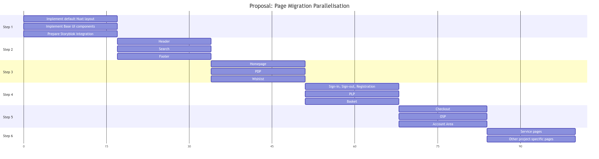

# SCAYLE Storefront Boilerplate - How-to Nuxt 3 Migration

This document roughly outlines the required steps to migrate from the former
Nuxt 2-based DemoShop to the new Nuxt 3-based Storefront Boilerplate.
Please keep in mind that this documentation is still being extended and will be regularly updated.

**NOTE: This "Step-by-Step" guide is only able to provide a rough overview of the order of steps.
It will not be able to provide detailed instructions for every tenant shop how to migrate every aspect,
due to differing scopes, complexity and amount of custom implementations per shop and tenant.
This also needs to be considered as part of a potential time estimation of a tenant migration!**

This How-to is assuming you're migration a Storefront Core v7-based project from Nuxt 2 to Nuxt 3.
Should an older version of Storefront Core be used within the project, the outlined steps
might diverge significantly or might not be applicable!

- _Last updated: 19. October 2023_

[[TOC]]

## 0. Prerequisites

Nuxt 3 is a complete rewrite of Nuxt 2, and also based on a new set of underlying technologies.
That means there will be significant changes when migrating a Nuxt 2 app to Nuxt 3,
thus an incremental migration of an existing project might not be feasible approach most of the time.

Some of these significant changes include:

- Moving from **Vue 2** to **Vue 3**, including defaulting to the **Composition API** and **script setup**.
- Moving from **webpack 4** and **Babel** to **Vite** and **Rollup**.
- Moving from a runtime Nuxt dependency to a minimal, standalone server compiled with **nitropack**.

The overall steps of this Nuxt 3 Migration Overview are modeled after the
official [Nuxt 3 Migration Guide](https://nuxt.com/docs/migration/overview),
which we recommend to checkout before proceeding with the SCAYLE DemoShop to
SCAYLE Storefront Boilerplate migration.

### Implication for Tenant migrations

- No direct small “incremental” migration possible where e.g. dependencies get exchanged piece by piece, due to large scale architecture changes of Nuxt 3
- With increasing project complexity, comes increased migration complexity and efforts
- No “One fits all” migration solution
- How-to guide can only provide a rough overview and the order in which certain migration steps should be undertaken
- Every tenant migration should have a coordinated kickoff meeting with review of the existing codebase and the creation of a dedicated migration concept

### Migration Approaches

#### Approach #1: Incremental migration

- migrating an existing Nuxt 2-based project
- Benefit:
  - Working in known codebase
  - Avoiding potential downsides of a rewrite, e.g. missing context of historic implementation
- Downsides:
  - Difficult to find ideal starting point for migration with existing Nuxt 2 codebase => Might leave developers with a daunting feeling
  - Difficult to test as parts of the application might not be migrated and compatible with Nuxt 3
  - Possibly unable to run shop application until a larger portion of the technical foundation has been migrated
  - Debugging difficult => Not clear if error originate from outdated Nuxt 2 dependencies or functionality, or missing Nuxt 3-specific implementations, leading to increased debugging times and plain frustration

#### Approach #2: "Clean slate" migration

- using an empty Nuxt 3 or fresh Storefront Boilerplate project and using Storefront Boilerplate implementation as reference
- setting up technical foundation first (dependencies, configs, modules)
- moving custom implementations piece by piece (pages, components, composables)
- Benefit:
  - Working version of shop application throughout the development process
  - Rapid testing and validation of migrated elements
- Downsides:
  - Feeling of building a whole new application & appears as if it might take more time than an incremental migration
  - Storefront Boilerplate implementation might contain unused code that might need to be thrown out

As a rule of thumb, if your application has not diverged much from the cloned boilerplate it is likely easier to start fresh from the Nuxt 3 boilerplate and re-apply your changes. If your application has a long history and significant changes from the original boilerplate it might be easier to attempt an incremental migration.

### Abbreviations

- `SFC` = `Storefront Core`
- `SFB` = `Storefront Boilerplate`
- `TBA` = `Token-based Authentication`

### Terminology

To simplify this guide and future documentation, we will establish the following streamlined terminology.

- `Storefront Core` / `SFC`
  - Connected packages containing composables, helpers and components to interact with SCAYLE APIs through `Storefront API`.
- `DemoShop` / `Nuxt 2 DemoShop`
  - Nuxt 2-based example shop application
- `Storefront Boilerplate` / `SFB`
  - Nuxt 3-based example shop application
- `demo-nuxt2`
  - Basic SFC-internal test application based on Nuxt 2
- `demo-nuxt3`
  - Basic SFC-internal test application based on Nuxt 3

### Preparing a Nuxt 2-based project

Many of the changes in Nuxt 3 and `storefront-nuxt` have been backported to Nuxt 2 and `storefront-nuxt2`. You can minimize the scope of the migration by performing these tasks ahead of the migration.

- Update to Node.js >= 20.6
- Update to latest version of `@scayle/storefront-nuxt2`
- Review and replace dependencies that are not Nuxt 3 compatible. Removing superfluous dependencies will lower the migration effort.
  - See [Overview Module support](#overview-module-support)
- Clean up any deprecated Vue features that do not work in Vue 3 (e.g. filters)
  - See [Vue 3 Breaking changes](https://v3-migration.vuejs.org/breaking-changes/#removed-apis>)
- Migrate to token-based authentication
- Migrate from legacy redirects to BAPI redirects
- Migrate from basic auth for BAPI to token auth
- Use `script setup` for components
- Introduce tailored SCAYLE `eslint` config -> `@scayle/eslint-config-storefront`
- Introduce tailored SCAYLE `prettier` config -> `@scayle/prettier-config-storefront`

- _Optional_: Rewrite SCSS-based styling to CSS to reduce complexity and make use of modern native CSS features
- _Optional_: Remove storybook. The Nuxt 3 boilerplate does not include storybook, so especially if you are using the "clean slate" migration you might want to consider removing storybook and story files.

### Overview Module support

The following list provides an overview of all formerly used Nuxt 2 modules of the DemoShop
and their Nuxt 3 migration resolution. Should other 3rd-party modules be used in a project,
it is required to investigate their Nuxt 3 support before the start of a respective Nuxt 3 project migration.

| Package / Module           | Usage                                                    | Nuxt 3 compatible | Resolution                                                                                    |
| -------------------------- | -------------------------------------------------------- | ----------------- | --------------------------------------------------------------------------------------------- |
| `@nuxt/typescript-runtime` | Provides TypeScript integration for Nuxt 2               | ❌                | **Module not required for Nuxt 3**, native with Nuxt 3                                        |
| `@nuxtjs/composition-api`  | Provides Composition API support for Vue 2               | ❌                | **Module not required for Nuxt 3**, native with Vue 3                                         |
| `@nuxtjs/google-fonts`     | Provides Google Fonts integration                        | ✅                | _Update to v3 of module_                                                                      |
| `@nuxtjs/gtm`              | Provides Google Tag Manager integration                  | ❌                | Use Nuxt 3 alternative `@zadigetvoltaire/nuxt-gtm`                                            |
| `@nuxtjs/i18n`             | Provides internationalization capabilities               | ✅                | _Update to v8 of module_                                                                      |
| `@nuxt/image`              | Provides plug-and-play image optimization                | ✅                | _Update to v1.0 (RC) of module_                                                               |
| `@nuxtjs/robots`           | Provides robots.txt support                              | ✅                | _Update to v3 of module_                                                                      |
| `@nuxtjs/sentry`           | Provides Sentry.io monitoring and tracing integration    | ❌                | [Custom plugin implementation required](https://www.lichter.io/articles/nuxt3-sentry-recipe/) |
| `@nuxtjs/storybook`        | Provides Storybook integration                           | ✅                | _Update to v7 of module_                                                                      |
| `@nuxtjs/tailwindcss`      | Provides TailwindCSS integration                         | ✅                | Parallel support for Nuxt 2 and Nuxt 3                                                        |
| `@nuxtjs/toast`            | Provides toast notification                              | ❌                | Custom implementation required (See SFB reference implementation)                             |
| `@storyblok/nuxt-2`        | Provides Storyblok CMS integration                       | ✅                | Use Nuxt 3 module `@storyblok/nuxt`                                                           |
| `nuxt-jsonld`              | Provides JSON-LD for SEO purposes                        | ✅                | _Update to v2 of module_                                                                      |
| `nuxt-svg-loader`          | Provides handling of SVG files as Vue components         | ❌                | Use Nuxt 3 alternative `nuxt-svgo`                                                            |
| `vueuse`                   | Provides helper and utility functions as Vue composables | ✅                | Parallel support for Nuxt 2 and Nuxt 3                                                        |
| `vue-fragment`             | Provides multi-root-node support for Vue components      | ❌                | **Module not required for Nuxt 3**, native with Vue 3                                         |
| `vue-lazy-hydration`       | Provides delayed client-side hydration functionality     | ❌                | Use Nuxt 3 alternative `nuxt-lazy-hydrate`                                                    |
| `vue-observe-visibility`   | Provides client-side visibility observer                 | ❌                | Use `Intersect.vue` from SFB or `useIntersectionObserver` from `vueUse`                       |
| `vue-slick-carousel`       | Provides carousel / slideshow integration                | ❌                | Use Nuxt 3 alternative `nuxt-swiper`                                                          |
| `vue-slider-component`     | Provides a range slider Vue component                    | ✅                | _Update to v4.0 (Beta)_                                                                       |
| `@vue/test-utils`          | Provides test utilities for Vue                          | ✅                | _Update to v2 of package_                                                                     |
| `@vue/vue2-jest`           | Provides Vue component transformer for Jest              | ❌                | Migrate from `jest` to `vitest`                                                               |
| `vue-the-mask`             | Provides string masking functionality                    | ❌                | Migrate to `maska`                                                                            |
| `vuelidate`                | Provide input validation wit Vue v-model support         | ✅                | Parallel support for Vue 2 and Vue 3                                                          |

## 1. Setup

Based on the mentioned significant architectural differences, we recommend to have a look
into the codebase of the new Nuxt 3-based SCAYLE Storefront Boilerplate beforehand.
This allows you to get a feeling for the larger changes and structural differences.

Even with the knowledge from all Nuxt 3 Migration guides, the overall migration from Nuxt 2
to Nuxt 3 is a large undertaking. It should be expected that many implementations might break
during the migration process and need to be adapted to Vue 3, Nuxt 3 and replacement libraries.

### 1.1. Dependency changes between Nuxt 2 and Nuxt 3

The first step to start the migration process should be to replace all necessary dependencies
with suitable Nuxt 3 compatible versions and remove everything that will not be needed anymore.
The following sections will shortly outline the differences in dependencies between a Nuxt 2-based
DemoShop and a Nuxt 3-based SCAYLE Storefront Boilerplate.

#### 1.1.1. devDependencies

Following a list of Nuxt 2-based DemoShop devDependencies and if they need to be migrated to Nuxt 3:

| Package / Module                                     | Required for Nuxt 3 | Note                                                     |
| ---------------------------------------------------- | ------------------- | -------------------------------------------------------- |
| `@aboutyou/storyblok-generate-ts`                    | ✅                  |                                                          |
| `@babel/core`                                        | ❌                  | Not required anymore for Nuxt 3 build setup              |
| `@babel/plugin-proposal-nullish-coalescing-operator` | ❌                  | Not required anymore for Nuxt 3 build setup              |
| `@babel/plugin-proposal-optional-chaining`           | ❌                  | Not required anymore for Nuxt 3 build setup              |
| `@babel/plugin-transform-class-properties`           | ❌                  | Not required anymore for Nuxt 3 build setup              |
| `@babel/plugin-transform-runtime`                    | ❌                  | Not required anymore for Nuxt 3 build setup              |
| `@babel/preset-typescript`                           | ❌                  | Not required anymore for Nuxt 3 build setup              |
| `@nuxt/image`                                        | ✅                  |                                                          |
| `@nuxt/types`                                        | ✅                  |                                                          |
| `@nuxtjs/eslint-config-typescript`                   | ❌                  | Included in `@scayle/eslint-config-storefront`           |
| `@nuxtjs/storybook`                                  | 🤷                  | Optional, depending on project requirement               |
| `@nuxtjs/tailwindcss`                                | ✅                  |                                                          |
| `@scayle/eslint-config-storefront`                   | ✅                  |                                                          |
| `@scayle/prettier-config-storefront`                 | ✅                  |                                                          |
| `@types/color`                                       | ✅                  |                                                          |
| `@types/express-session`                             | ❌                  | Replaced by `@scayle/h3-session` including types         |
| `@types/tailwindcss`                                 | 🤷                  | Optional, depending on project requirement               |
| `@vue/test-utils`                                    | ✅                  |                                                          |
| `@vue/vue2-jest`                                     | ❌                  | `jest` should be replaced by `vitest`                    |
| `babel-jest`                                         | ❌                  | Not required anymore for Nuxt 3 test setup with `vitest` |
| `cypress`                                            | ✅                  |                                                          |
| `cypress-real-events`                                | ✅                  |                                                          |
| `env-cmd`                                            | ✅                  |                                                          |
| `eslint`                                             | ✅                  |                                                          |
| `eslint-plugin-cypress`                              | ✅                  |                                                          |
| `eslint-plugin-nuxt`                                 | ✅                  |                                                          |
| `eslint-plugin-tailwindcss`                          | ✅                  |                                                          |
| `jest`                                               | ❌                  | `jest` should be replaced by `vitest`                    |
| `postcss-html`                                       | ✅                  |                                                          |
| `prettier`                                           | ✅                  |                                                          |
| `prettier-plugin-tailwindcss`                        | ✅                  |                                                          |
| `sass`                                               | 🤷                  | Optional, depending on project requirement               |
| `sass-loader`                                        | ❌                  | Not required, `vite` has built-in `sass` support         |
| `schema-dts`                                         | ✅                  |                                                          |
| `speed-measure-webpack-plugin`                       | ❌                  | `vite` is now used as Nuxt 3 build tool                  |
| `start-server-and-test`                              | ✅                  |                                                          |
| `storyblok`                                          | ✅                  |                                                          |
| `storybook-addon-mock`                               | 🤷                  | Optional, depending on project requirement               |
| `stylelint`                                          | ✅                  |                                                          |
| `stylelint-config-prettier`                          | ✅                  |                                                          |
| `stylelint-config-standard`                          | ✅                  |                                                          |
| `stylelint-config-standard-scss`                     | ✅                  |                                                          |
| `stylelint-config-standard-vue`                      | ✅                  |                                                          |
| `stylelint-high-performance-animation`               | ✅                  |                                                          |
| `tailwindcss`                                        | ✅                  |                                                          |
| `ts-jest`                                            | ❌                  | `jest` should be replaced by `vitest`                    |
| `ts-loader`                                          | ❌                  | Nuxt 3 provides Out-of-the-box TypeScript support        |
| `ts-node`                                            | ❌                  | Nuxt 3 provides Out-of-the-box TypeScript support        |
| `typescript`                                         | ✅                  |                                                          |
| `vue-eslint-parser`                                  | ❌                  | Included in `@scayle/eslint-config-storefront`           |
| `vue-tsc`                                            | ✅                  |                                                          |

Following a list of devDependencies that should ba additionally added as part of the Nuxt 3 migration preparations:

- `@nuxt/devtools`
- `@zadigetvoltaire/nuxt-gtm`
- `autoprefixer`
- `nuxt-svgo`
- `nuxt-viewport`
- `ofetch`
- `postcss-custom-properties`
- `utility-types`

#### 1.1.2. dependencies

Following a list of Nuxt 2-based DemoShop dependencies and if they need to be migrated to Nuxt 3:

✅❌

| Package / Module            | Required for Nuxt 3 | Note                                                                                          |
| --------------------------- | ------------------- | --------------------------------------------------------------------------------------------- |
| `@crowdin/cli`              | 🤷                  | Optional, depending on project requirement                                                    |
| `@nuxt/typescript-runtime`  | ❌                  | Nuxt 3 provides Out-of-the-box TypeScript support                                             |
| `@nuxtjs/composition-api`   | ❌                  | Vue 3 provides Out-of-the-box Composition API support                                         |
| `@nuxtjs/google-fonts`      | 🤷                  | Optional, depending on project requirement                                                    |
| `@nuxtjs/gtm`               | ✅                  | Use alternative package `@zadigetvoltaire/nuxt-gtm`                                           |
| `@nuxtjs/i18n`              | ✅                  |                                                                                               |
| `@nuxtjs/robots`            | ✅                  |                                                                                               |
| `@nuxtjs/sentry`            | ❌                  | [Custom plugin implementation required](https://www.lichter.io/articles/nuxt3-sentry-recipe/) |
| `@scayle/omnichannel-nuxt`  | ❌                  | Not yet supported with Nuxt 3 Storefront Boilerplate                                          |
| `@scayle/storefront-nuxt2`  | ➡️                  | Migrate to `@scayle/storefront-nuxt`                                                          |
| `@storyblok/nuxt-2`         | ➡️                  | Migrate to `@storyblok/nuxt`                                                                  |
| `@tailwindcss/aspect-ratio` | ✅                  |                                                                                               |
| `@tailwindcss/forms`        | ✅                  |                                                                                               |
| `@tailwindcss/typography`   | ✅                  |                                                                                               |
| `@types/consola`            | 🤷                  | Optional, depending on project requirement                                                    |
| `@vuelidate/core`           | ✅                  |                                                                                               |
| `@vuelidate/validators`     | ✅                  |                                                                                               |
| `@vueuse/core`              | ✅                  |                                                                                               |
| `@vueuse/nuxt`              | ✅                  |                                                                                               |
| `axios`                     | 🤷                  | We recommend to use `ofetch`, which is used by Nuxt 3 itself                                  |
| `body-parser`               | ❌                  | Express plugin that is not necessary with h3                                                  |
| `check-password-strength`   | ✅                  |                                                                                               |
| `color`                     | ✅                  |                                                                                               |
| `consola`                   | 🤷                  | Optional, depending on project requirement                                                    |
| `dotenv`                    | ✅                  |                                                                                               |
| `envalid`                   | ❌                  | No runtime env validation possible                                                            |
| `express`                   | ❌                  | `express` has ben replaced by `nitropack` and `h3` within Nuxt 3, not required                |
| `express-session`           | ➡️                  | Migrate to `@scayle/h3-session`                                                               |
| `jws`                       | 🤷                  | Optional, depending on project requirement                                                    |
| `maska`                     | ✅                  |                                                                                               |
| `mobile-detect`             | ❌                  | Replaced by `nuxt-viewport`                                                                   |
| `nuxt`                      | ✅                  |                                                                                               |
| `nuxt-jsonld`               | ✅                  |                                                                                               |
| `nuxt-svg-loader`           | ❌                  | Replaced by `nuxt-svgo`                                                                       |
| `portal-vue`                | ❌                  | Native Vue 3 functionality                                                                    |
| `postcss`                   | ✅                  |                                                                                               |
| `postcss-import`            | ✅                  |                                                                                               |
| `radash`                    | ➡️                  | Migrate to `radash-nuxt`                                                                      |
| `slugify`                   | ❌                  |                                                                                               |
| `storyblok-js-client`       | ✅                  |                                                                                               |
| `ufo`                       | ✅                  |                                                                                               |
| `vue`                       | 🤷                  | Optional, depending on project requirement                                                    |
| `vue-lazy-hydration`        | ➡️                  | Replaced by `nuxt-lazy-hydrate`                                                               |
| `vue-router`                | ❌                  |                                                                                               |
| `vue-slick-carousel`        | ➡️                  | Replaced by `nuxt-swiper`                                                                     |
| `vue-slider-component`      | ✅                  |                                                                                               |
| `vue-swipe-actions`         | ❌                  | No replacement                                                                                |
| `vue-text-highlight`        | ❌                  |                                                                                               |

Following a list of dependencies that should ba additionally added as part of the Nuxt 3 migration preparations:

- `nanoid`
- `radash-nuxt`
- `nuxt-lazy-hydrate`
- `nuxt-swiper`
- `yn`

### 1.1. Basic Configuration, Runtime Config & .env

Refer to [Nuxt 3 Migration Guide / Configuration](https://nuxt.com/docs/migration/configuration) for Nuxt 3 specific migration steps.

The starting point for your Nuxt app remains your `nuxt.config.ts` file.

With the migration to Nuxt 3, one goal of the migration has been to make the application as built independent as possible ("build once, deploy anywhere").
This meant moving most of the configuration options filled by environment variables to use the Nuxt 3 [runtimeConfig](https://nuxt.com/docs/guide/going-further/runtime-config).

As the `nuxt.config.ts` file is now pre-generated and serialized during build time,
is is not able to execute dynamic functions, e.g. `fetchStores` during runtime anymore.
This means all usages of dynamic functions within the `nuxt.config.ts` need to be replaced with
specified key/value objects. Should the need arise to inject values dynamically, this should
be done at runtime using the Nuxt 3 [runtimeConfig](https://nuxt.com/docs/guide/going-further/runtime-config).

For specific changes as part of the Storefront Boilerplate, check the [SCAYLE Storefront Boilerplate Migration Guide](./migration-demoshop.md).

### 1.2. Build Tooling

Refer to [Nuxt 3 Migration Guide / Build Tooling](https://nuxt.com/docs/migration/bundling) for Nuxt 3 specific migration steps.

Per default the SCAYLE Storefront Boilerplate is using [vite](https://vitejs.dev/) and [Rollup](https://rollupjs.org/),
including [PostCSS](https://postcss.org/) and [esbuild](https://esbuild.github.io/) as build tools.

Should the Nuxt 2-based rely on custom Webpack 4 configuration, the changes need to be adapted for usage with [vite (Nuxt 3 Vite Config)](https://nuxt.com/docs/api/configuration/nuxt-config#vite).

### 1.3. State Management

Storefront Boilerplate does not include VueX by default.
The `useStore` composable has been introduced which is using the `useState` under the hood.

Should the requirement call for a more versatile state management solution, we recommend migration to `pinia`.
Check the [Pinia Documentation](https://pinia.vuejs.org/core-concepts/) for more detailed information.

## 2. Plugins, Modules & Middleware

Refer to [Nuxt 3 Migration Guide / Plugins and Middleware](https://nuxt.com/docs/migration/plugins-and-middleware) or [Nuxt 3 Migration Guide / Modules](https://nuxt.com/docs/migration/module-authors) for Nuxt 3 specific migration steps.

_NOTE: Please note that the format for plugins, modules and router middleware has changed and former Nuxt 2 modules will not be compatible!_

Due to the nature of the open source ecosystem, not every module that has been used as part of the Nuxt 2-based DemoShop, will be available as part of the Nuxt 3-based Storefront Boilerplate or will have a drop-in replacement.

The following modules or custom implementations have been replaced:

- `nuxt-svg-loader` replaced by `nuxt-svgo`
  - Check [Storefront Boilerplate Migration Guide / SVG handling](./migration-demoshop.md#svg-handling)
- `vue-slick-carousel` replaced by `Swiper`
  - Check [Storefront Boilerplate Migration Guide / Carousel Implementation](./migration-demoshop.md#carousel-implementation-vue-slick-carousel-replaced-with-swiper)
- `@nuxtjs/gtm` by `@zadigetvoltaire/nuxt-gtm`
  - Check [Storefront Boilerplate Migration Guide / Tracking](./migration-demoshop.md#tracking)
- Replaced custom breakpoints implementation with `nuxt-viewport` module
  - Check [Storefront Boilerplate Migration Guide / Breakpoints handling](./migration-demoshop.md#breakpoints-handling)

For specific changes as part of the Storefront Boilerplate, check the [SCAYLE Storefront Boilerplate Migration Guide](./migration-demoshop.md).

## 3. Pages, Layouts & Storyblok

Refer to [Nuxt 3 Migration Guide / Configuration](https://nuxt.com/docs/migration/configuration) for Nuxt 3 specific migration steps.

After getting the technical foundation, using the Nuxt 3-based Storefront Boilerplate, up and running,
the integral part of the migration process is the migration and refactoring of all pages and related components.

We recommend doing a page by page approach, which can be parallelized to reduce time constraints and dependencies. Based on initial feedback a potential page migration order might look as follows:

```mermaid
gantt
    title Proposal: Page Migration Parallelization
    dateFormat X
    axisFormat %s
    section Step 1
    Implement default Nuxt layout :0, 17
    Implement Base UI components :0, 17
    Prepare Storyblok integration :0, 17
    section Step 2
    Header :17, 34
    Search :17, 34
    Footer :17, 34
    section Step 3
    Homepage :34, 51
    PDP :34, 51
    Wishlist :34, 51
    section Step 4
    Sign-in, Sign-out, Registration :51, 68
    PLP :51, 68
    Basket :51, 68
    section Step 5
    Checkout :68, 84
    OSP :68, 84
    Account Area :68, 84
    section Step 6
    Service pages :84, 100
    Other project-specific pages :84, 100
```

<!--  -->

## 3.1. Base UI components

The Storefront Boilerplate introduces some refactoring to improve long-term maintainability,
usability and to reduce code redundancy.

One such case of decreased redundancy has been the introduction of shared base UI components
within the Storefront Boilerplate reference implementation.
This includes most commonly used UI components across the application (Buttons, Links, Inputs, Toast, layout related components, etc.) to be used during implementation of the bigger chunks of the application (pages, layouts etc).

Depending on the project size and complexity, this approach can reduce the overall migration efforts.

## 3.2. Component Options

Refer to [Nuxt 3 Migration Guide / Component Options](https://nuxt.com/docs/migration/component-options) for Nuxt 3 specific migration steps.

### 3.2.1. Data fetching

Nuxt 3 provides new options for [fetching data](https://nuxt.com/docs/getting-started/data-fetching) from an API. Nuxt 3 provides new composables for fetching data: `useAsyncData` and `useFetch`. They each have 'lazy' variants (`useLazyAsyncData` and `useLazyFetch`), which do not block client-side navigation.

To make your existing pages and components compatible with the new data fetching approach,
the following steps are required:

1. Replace the `asyncData` hook with `useAsyncData` or `useFetch` in your page/component.
2. Replace the `fetch` hook with `useAsyncData` or `useFetch` in your component.

### 3.2.2. scrollToTop

This feature is not yet supported in Nuxt 3. If you want to overwrite the default scroll behavior of vue-router, you can do so in `~/app/router.options.ts` (see [Router options docs](https://nuxt.com/docs/guide/going-further/custom-routing#router-options)) for more info.

## 3.3. Meta Tags

Refer to [Nuxt 3 Migration Guide / Meta](https://nuxt.com/docs/migration/meta) for Nuxt 3 specific migration steps.

Nuxt 3 provides several different ways to manage your meta tags:

- via `nuxt.config.ts`
- via `useHead` [composable](https://nuxt.com/docs/getting-started/seo-meta#usehead)
- via [global meta components](https://nuxt.com/docs/getting-started/seo-meta)

You can customize `title`, `titleTemplate`, `base`, `script`, `noscript`, `style`, `meta`, `link`, `htmlAttrs` and `bodyAttrs`.

## 4. Server & Deployment

Refer to [Nuxt 3 Migration Guide / Configuration](https://nuxt.com/docs/migration/configuration) for Nuxt 3 specific migration steps.

In a built Nuxt 3 application, there is no runtime Nuxt dependency and no support
from sourcing environment variables / runtimeConfig overrides from an `.env` file.

Should there be a need to source environment variables / runtimeConfig overrides from an `.env` file,
we recommend using a Node.js version higher than `20.6`, which includes [native .env file support](https://nodejs.org/en/blog/release/v20.6.0#built-in-env-file-support).

For more in-depth information regarding Nuxt 3 deployment options check the [official Nuxt 3 Deployment Guide](https://nuxt.com/docs/getting-started/deployment#deployment).

## 5. Troubleshooting

Throughout the migration process there might be possible complications due to a variety of
changes within Nuxt 3 itself and the Storefront Core packages. This section will provide some
already encounter issues during migrations and outline potential mitigation.

### Dynamic / async component loading

- **Problem**
  - The `DefaultLink` component is causing a full page reload
  - Button click-event handlers are not firing
- **Solution**
  - Rename all `{component}.async.vue` to `{component}.vue`
  - [Nuxt 3 Dynamic Imports](https://nuxt.com/docs/guide/directory-structure/components#dynamic-imports)
